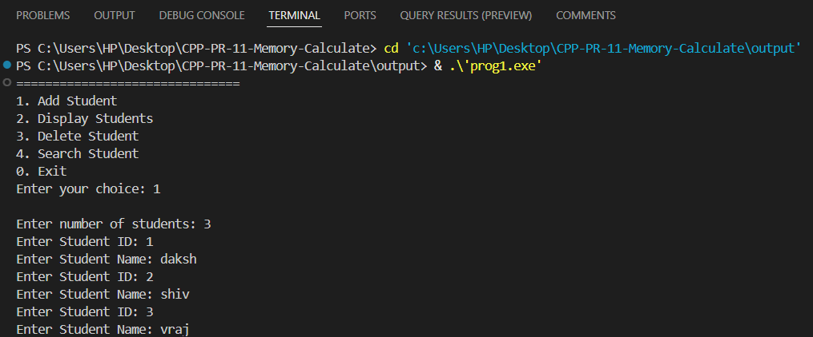
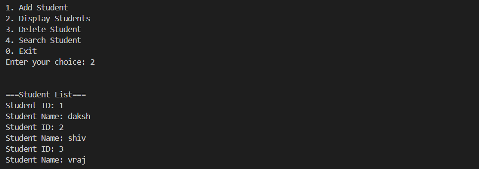
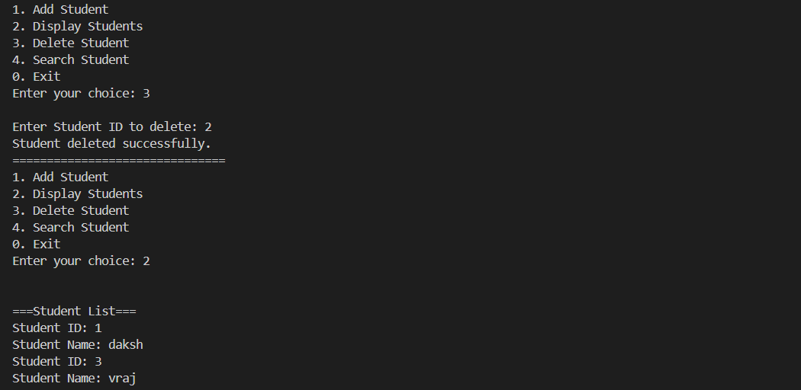
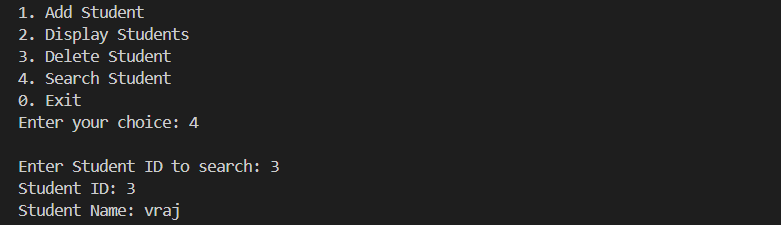
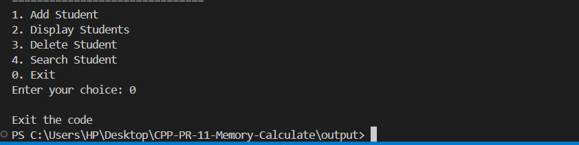

Choice 1:


Choice 2:


Choice 3:


Choice 4:


Choice 5:



# Student Management System Documentation

## Overview
The **Student Management System** is a simple C++ program that allows users to manage student records using templates. The system enables adding, displaying, deleting, and searching for students by ID.

## Features
- Add student details (ID and Name)
- Display all student records
- Delete a student by ID
- Search for a student by ID
- Uses C++ templates for flexibility in ID data types

## Class Structure

### 1. `Memory<T>` (Template Base Class)
- Stores student IDs (`vector<T> sid`) and names (`vector<string> sname`).
- Provides a base structure for storing student records.

### 2. `Student<T>` (Template Derived Class)
- Inherits from `Memory<T>`.
- Implements the following functions:
  - `addStudent()`: Adds student ID and name.
  - `displayStudent()`: Displays all students.
  - `deleteStudent()`: Removes a student by ID.
  - `searchStudent()`: Searches for a student by ID.

## Usage Instructions
### Compilation
Compile the program using the following command:
```sh
 g++ student_management.cpp -o student_management
```
### Running the Program
Run the compiled executable:
```sh
 ./student_management
```

### Menu Options
When you run the program, you will be presented with the following options:
```
===============================
1. Add Student
2. Display Students
3. Delete Student
4. Search Student
0. Exit
Enter your choice:
```
- **Option 1**: Enter the number of students, their ID, and name.
- **Option 2**: Displays the list of all students.
- **Option 3**: Enter a student ID to remove the student from records.
- **Option 4**: Enter a student ID to search for their details.
- **Option 0**: Exit the program.

## Example Execution
```
Enter your choice: 1
Enter number of students: 2
Enter Student ID: 101
Enter Student Name: Alice
Enter Student ID: 102
Enter Student Name: Bob

Enter your choice: 2
===Student List===
Student ID: 101
Student Name: Alice
Student ID: 102
Student Name: Bob
```

## Future Enhancements
- Implement file handling for persistent data storage.
- Improve input validation and error handling.
- Add a graphical user interface (GUI) for better user experience.

## License
This project is open-source and free to use for educational purposes.

